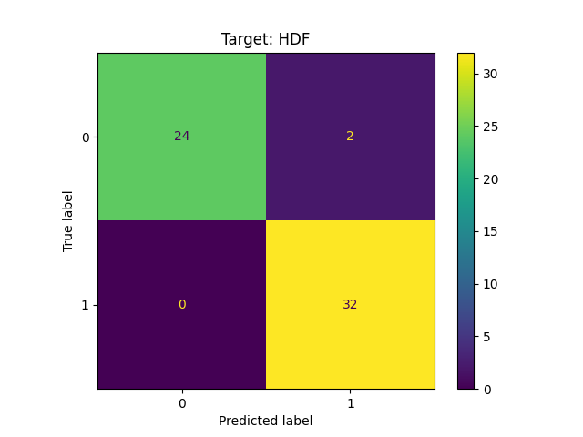

# Overview

Using data from the [Universite of Irvine California](https://archive.ics.uci.edu/dataset/601/ai4i+2020+predictive+maintenance+dataset) multiple logistic regression models are created to predict and classify what type of failure can occur based on the machines health metrics. A hypothesis test is also performed to see if there is a difference between the rotational speed of working machines and failed machines.

# Data
There are 10000 rows and 14 columns of data. Each row represents a unique machine
#### Features
* Air temperature (kelvin)
    * The ambient temperature 
* Process temperature (kelvin)
    * Interal temperature of the machine
* Rotational speed (rpm)
* Torque (Nm)
* Tool wear (min)
    * How long the machine was running for
* Product Quality (Low, Medium, High)

#### Targets
All the targets are binary values, 0 if working and 1 if failed
* Machine failure
* TWF (Tool wear failure)
* HDF (Heat dissapation failure)
* PWF (Power failure)
* OSF (Overstrain failure)
* RNF (Random failure)

# Hypothesis Test

### Null: The average rotational speed of failed machines is the same as working machines
### H0: u1 = u2
### Alt: The average rotational speed of failed machines is not the same as working machines
### Ha: u1 != u2 (two-tailed)
### Alpha: 0.05

#### Results
T-statistic= -2.086776240544015 <br>
pvalue= 0.03764747644388529 <br> 
df= 342.4998844387028 <br>

The two-tailed p-value of 0.038 is less than the alpha of 0.05. There is sufficient statistical evidence to reject the null hypothesis.
The negative test statistic indicates the average rmp of failed machines is slower than the working machines.


# Logistic Regression Models
Do to the huge imbalance of the failure classes, imblearn's oversampling methods and undersampling methods were used to correct this imbalance as best it could. All models underwent both methods and the one with the best performance is listed below.<br>


For a HDF undersampling performed the best<br>
Accuracy: 0.97 <br>
Precision: 0.93 <br>
Recall: 1.0 <br>
F1: 0.96 <br>


For a general machine failure undersampling performed the best<br>
Accuracy: 0.83 <br>
Precision: 0.85 <br>
Recall: 0.84 <br>
F1: 0.84 <br>


For a OSF oversampling performed the best<br>
Accuracy: 0.998 <br>
Precision: 0.94 <br>
Recall: 0.87 <br>
F1: 0.91 <br>


For a PWF oversampling performed the best<br>
Accuracy: 0.997 <br>
Precision: 0.94 <br>
Recall: 0.78 <br>
F1: 0.84 <br>


As you can see below, there are so few RNF data points that is was not possible with either methods to produce a decent model. No model was created for this type of failure.<br>


For a TWF undersampling performed the best<br>
Accuracy: 0.97 <br>
Precision: 0.96 <br>
Recall: 0.98 <br>
F1: 0.96 <br>


# Streamlit
You can use the model here at [Streamlit](https://ctwills-capstone-predictive-maintenance-streamlit-app-yjzeo6.streamlit.app/).

To run locally, install the packages in requirements_streamlit.txt file and run the streamlit_app.py file by entering ```streamlit run streamlit_app.py```